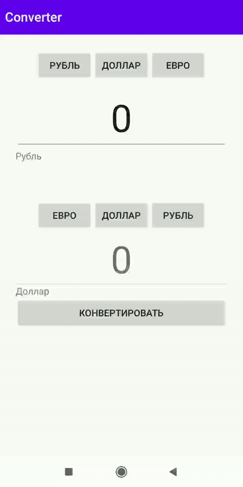

# Currency converter

Возможность конвертировать набор валют (рубль/евро/доллар) друг в друга по фиксированным курсам. (Курс 74 рубля за доллар, курс 78 рублей за евро)

## Пример работы

## Running

Run app/src/main/java/com/example/myapplication/MainActivity.kt

## Authors

* **Галина Игнатова** - [igalaxy-git](https://github.com/igalaxy-git)
